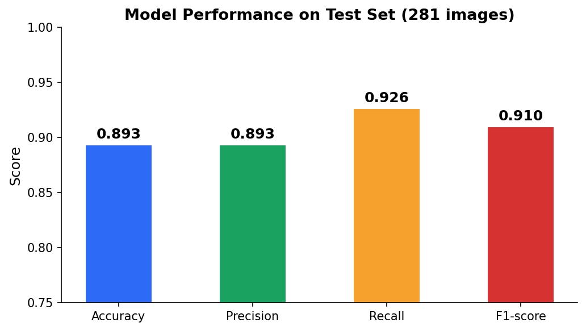
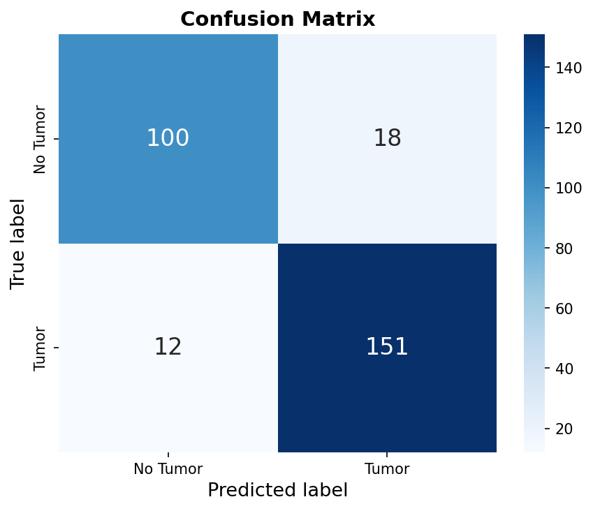
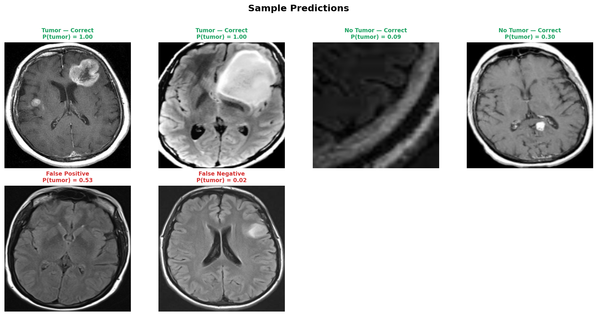

# Brain Tumor Detection

An end-to-end deep learning application that detects brain tumors from MRI images using a Convolutional Neural Network (CNN) built with TensorFlow/Keras, deployed as a web application with Flask.

**Live Demo:** [brain-tumor-detector-production.up.railway.app](https://brain-tumor-detector-production.up.railway.app)

---

## Project Overview

This project automatically classifies brain MRI images as tumorous or non-tumorous using a CNN trained from scratch.

The full pipeline includes:
- Data exploration and class imbalance analysis
- Data augmentation (253 → 2065 images)
- Image preprocessing: ROI extraction, resize to 240×240, normalization
- CNN training with Dropout regularization
- Model evaluation on 281 held-out test images
- Web application deployment with Flask, Docker, and Railway

---

## Results

| Metric | Score |
|---|---|
| Accuracy | 89.3% |
| F1-score | 0.91 |
| Precision | 0.89 |
| Recall | 0.93 |
| Test set | 281 images |

**Metrics overview**



**Confusion Matrix**



**Sample Predictions**



---

## Model Architecture

```
Input (240×240×3)
    ↓
ZeroPadding2D
    ↓
Conv2D (32 filters, 7×7) → BatchNormalization → ReLU
    ↓
MaxPooling2D (4×4) → Dropout (0.25)
    ↓
MaxPooling2D (4×4)
    ↓
Flatten → Dense (32, ReLU) → Dropout (0.5)
    ↓
Dense (1, Sigmoid)  →  0 = No Tumor / 1 = Tumor
```

Transfer learning models (ResNet50, VGG16) overfitted on this small dataset. A lightweight custom CNN with Dropout regularization performs better.

---

## Preprocessing Pipeline

Every MRI image goes through 3 steps before prediction:

1. **ROI Extraction** — detects and crops only the brain region using contour detection, removing the black background
2. **Resize** — standardizes all images to 240×240×3
3. **Normalization** — scales pixel values from [0, 255] to [0.0, 1.0]

---

## Dataset

- **Source:** Kaggle — Brain MRI Images for Brain Tumor Detection
- **Original size:** 253 images (155 tumor / 98 no tumor)
- **After augmentation:** 2065 images
- **Split:** 80% train / 20% test (stratified)
- **Classes:** Binary — `yes` (tumor) / `no` (no tumor)

---

## Project Structure

```
brain-tumor-detection/
│
├── app.py                        ← Flask backend
├── requirements.txt              ← Python dependencies
├── Dockerfile                    ← Docker configuration
│
├── models/
│   └── best_model.h5             ← Trained CNN model
│
├── templates/
│   └── index.html                ← Frontend HTML
│
├── static/
│   ├── style.css
│   └── script.js
│
├── results/
│   ├── confusion_matrix.png
│   ├── metrics.png
│   └── sample_predictions.png
│
├── 01_data_exploration.ipynb
├── 02_data_augmentation.ipynb
├── 03_preprocessing.ipynb
├── 04_model_training.ipynb
└── 05_evaluation.ipynb
```

---

## Run Locally

```bash
git clone https://github.com/akrourmoh/brain-tumor-detector.git
cd brain-tumor-detector
pip install -r requirements.txt
python app.py
```

Open `http://localhost:5000` in your browser.

---

## Tech Stack

| Layer | Technology |
|---|---|
| Deep Learning | TensorFlow / Keras |
| Image Processing | OpenCV, NumPy |
| Backend | Flask, Werkzeug |
| Frontend | HTML5, CSS3, JavaScript |
| Deployment | Docker, Railway |

---

## Author

**Mohammed Akrour**
- Master's in Biometrics & Intelligent Vision — UPEC Paris-Est Créteil
- [LinkedIn](https://linkedin.com/in/mohammed-akrour)
- [GitHub](https://github.com/akrourmoh)
